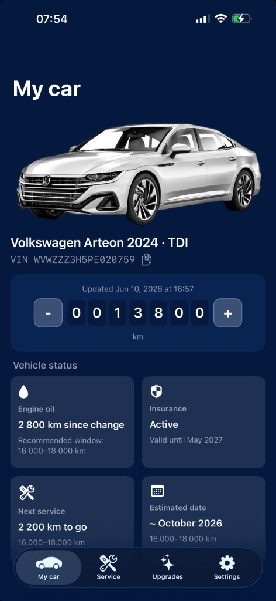
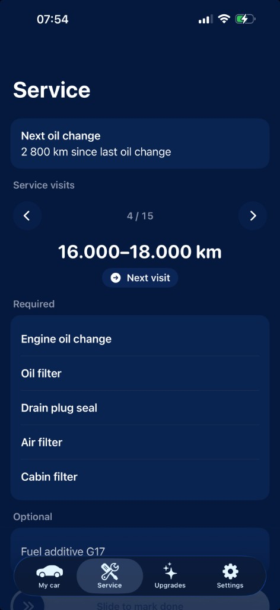

# pitstop-ios

Personal car diary: odometer, service visits, reminders, and insurance for your vehicle. Frozen side project — maintenance logging only, not an AI or portfolio flagship.

Today the app ships with one seeded vehicle (VW Arteon). A future version could support multiple cars by adding a vehicle manually or by decoding a VIN to pre-fill make, model, and year.

## Screenshots

Launch → My car → Service (default tab order).

  
  
  

## Stack

iOS 26+ · Xcode 26+ · SwiftUI · SwiftData · Foundation Models · UserNotifications · Swift Testing + XCTest · en / uk / ru · MVVM
