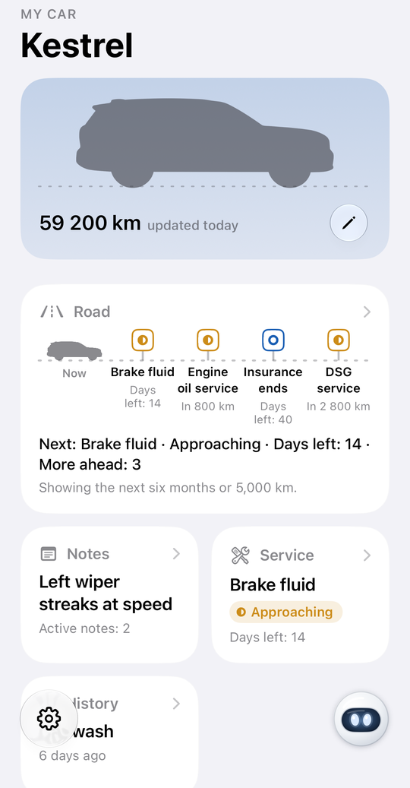

# PitStop

PitStop keeps your car's life in one place: jot down a thought about the car,
record what was actually done, and see which service and dates come next.

**Status:** on TestFlight, version 1.2.0 (tag `tf-1.2.0-1`, iOS 27) — what
changed is in the [changelog](CHANGELOG.md) and the
[1.2.0 release record](docs/operations/releases/1.2.0.md); not in the App Store yet.



## How this app is built

- **Coding agents with fixed roles:** one session plans and integrates, one writer per change works in its own git worktree, and a separate agent reviews; the developer approves plans and releases. Project rules for agents: [`AGENTS.md`](AGENTS.md).
- **Requirements first:** every behaviour is a numbered, testable requirement (Given/When/Then, EARS) that the owner approves before code: [`docs/requirements/`](docs/requirements/).
- **One verification gate:** `just verify` (build, lint, tests) before every commit; tests also run on each push to `main`.
- **Independent review:** each change is reviewed by an agent that did not write it, with findings graded high, medium or low; each release diff gets one more gate review before it ships.
- **Requirement-to-test matrix:** a round closes only when every requirement it cites has a passing test named with its ID — see the [RD-012 task brief](docs/tasks/rd-012-car-profile.md) and the other [task briefs](docs/tasks/).
- **Recorded decisions:** [decision records](docs/decisions/) and the [commit history](https://github.com/vil4max/pitstop-ios/commits/main), one reviewable change per commit.

## Stack

iOS 27+ · Xcode 27+ · Swift 6 language mode · SwiftUI · SwiftData · Vision · Foundation Models (off by default) · App Intents · WidgetKit · Swift Testing + XCTest · en / uk / ru · MVVM

## Product

Save a thought about the car, find it when needed, record what actually happened,
and understand what matters next. **Notes** hold thoughts and intentions;
**History** holds recorded events; **Service** calculates maintenance state;
**Road** shows eligible milestones. **Car Board** brings their summaries together.

**Remember** is the shared capture capability: preserve a raw thought without AI
or use optional interpretation to propose structured data. **Pit** helps with
capture and clarification; it is not navigation or the product itself.

These are [product contracts](docs/requirements/product-charter.md#product-loop-and-feature-responsibilities),
not a shipped feature list. What the app implements today is in the
[implementation inventory](docs/engineering/domain-inventory.md) and the as-built
[system overview](docs/engineering/system-overview.md).

## Project state

- **State and next task:** [`PROJECT_STATUS.md`](PROJECT_STATUS.md); open work in the [work plan](docs/planning/work-plan.md).
- **Docs index:** [`docs/`](docs/README.md).

## Distribution

- **Repo:** [vil4max/pitstop-ios](https://github.com/vil4max/pitstop-ios) (public, ADR 0014)
- **TestFlight:** tag-gated through Xcode Cloud ([ADR 0013](docs/decisions/0013-shared-ci-and-tag-gated-testflight.md)); version 1.2.0
- **Bundle ID:** `dev.vil4max.pitstop` (new App Store listing; not an update of the earlier prototype bundle)
- **SwiftData:** no automatic migration between bundle IDs; fresh install or manual re-import
- **iCloud (future):** `iCloud.dev.vil4max.pitstop`

## Development

The development process lives in the agents' shared engineering kit; this
repository keeps its project facts in [`AGENTS.md`](AGENTS.md) and
[Agent development](docs/engineering/agent-loop-and-gitflow.md#agent-development).
Product work follows `PROJECT_STATUS.md`.

```sh
just doctor --json
just verify
```

The installed Runtime and shell executors are included in this repository;
verification does not need access to the private kit repository.

`just verify` is the local gate. The shared Runtime tests workflow runs on
GitHub-hosted runners, and TestFlight builds are tag-gated
([ADR 0013](docs/decisions/0013-shared-ci-and-tag-gated-testflight.md)).
Each task records the commands and results in its brief under
[`docs/tasks/`](docs/tasks/). GitHub rulesets come from the Runtime templates in
`Tooling/templates/github/rulesets/` and require no hosted check.
Documentation-only edits do not require an app build. Local verification does
not prove independent review, release, or production AI capability.
