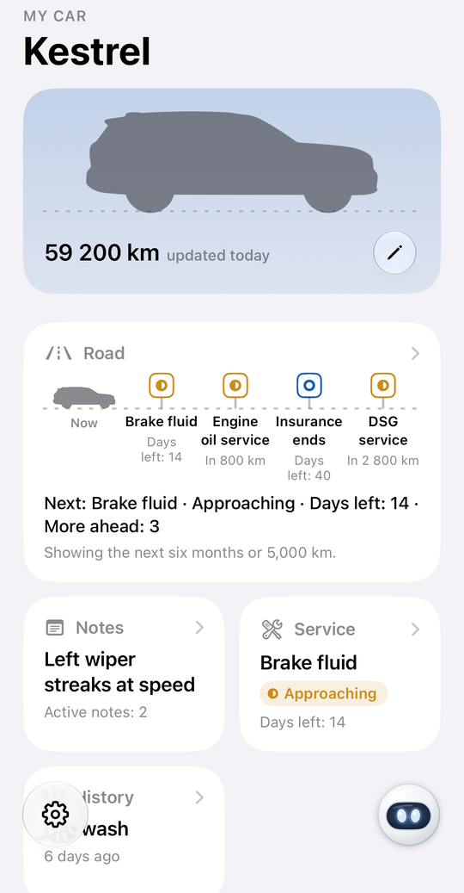

# PitStop

PitStop keeps your car's life in one place: jot down a thought about the car,
record what was actually done, and see which service and dates come next.

**Status:** on TestFlight, version 1.2.0 (tag `tf-1.2.0-1`, iOS 27) — what
changed is in the [changelog](CHANGELOG.md) and the
[1.2.0 release record](docs/operations/releases/1.2.0.md); not in the App Store yet.



## Product

Save a thought about the car, find it when needed, record what actually happened,
and understand what matters next. **Notes** hold thoughts and intentions;
**History** holds recorded events; **Service** calculates maintenance state;
**Road** shows eligible milestones. **Car Board** brings their summaries together.

**Remember** is the shared capture capability: preserve a raw thought without AI
or use optional interpretation to propose structured data. **Pit** helps with
capture and clarification; it is not navigation or the product itself.

These are [product contracts](docs/requirements/product-charter.md#product-loop-and-feature-responsibilities),
not a shipped feature list. What the app implements today is in the
[implementation inventory](docs/engineering/domain-inventory.md) and the as-built
[system overview](docs/engineering/system-overview.md).

## Stack

iOS 27+ · Xcode 27+ · Swift 6 language mode · SwiftUI · SwiftData · Vision · Foundation Models (off by default) · App Intents · WidgetKit · Swift Testing + XCTest · en / uk / ru · MVVM

## How it is built

- **Requirements first:** every behaviour is a numbered, testable requirement (Given/When/Then, EARS): [`docs/requirements/`](docs/requirements/).
- **Tests named after requirements:** tests in `PitstopTests/` carry the `REQ-<AREA>-NNN` ID of the requirement they verify. For example `REQ-BOARD-032`, "First launch never asks for a photo", is covered in [`PitstopTests/CarBoard/CarEditorTests.swift`](PitstopTests/CarBoard/CarEditorTests.swift).
- **Recorded decisions:** [decision records](docs/decisions/) state each product and architecture decision with its rationale.
- **One verification gate:** `just verify` (build, lint, tests); tests also run on each push to `main`.

## Project state

- **Current state:** [`PROJECT_STATUS.md`](PROJECT_STATUS.md).
- **Documentation index:** [`docs/`](docs/README.md).

## Distribution

- **Repo:** [vil4max/pitstop-ios](https://github.com/vil4max/pitstop-ios)
- **TestFlight:** tag-gated through Xcode Cloud ([ADR 0013](docs/decisions/0013-shared-ci-and-tag-gated-testflight.md)); version 1.2.0
- **Bundle ID:** `dev.vil4max.pitstop` (new App Store listing; not an update of the earlier prototype bundle)
- **SwiftData:** no automatic migration between bundle IDs; fresh install or manual re-import
- **iCloud (future):** `iCloud.dev.vil4max.pitstop`

## Development

```sh
just doctor --json
just verify
```

`just verify` is the local gate. The tests workflow runs on GitHub-hosted
runners, and TestFlight builds are tag-gated
([ADR 0013](docs/decisions/0013-shared-ci-and-tag-gated-testflight.md)).
Documentation-only edits do not require an app build.
Project conventions are in [`AGENTS.md`](AGENTS.md).
