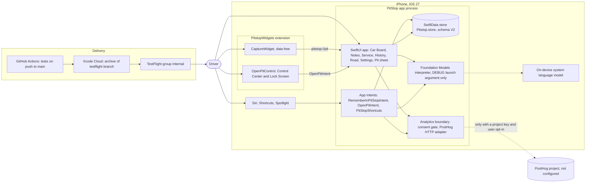
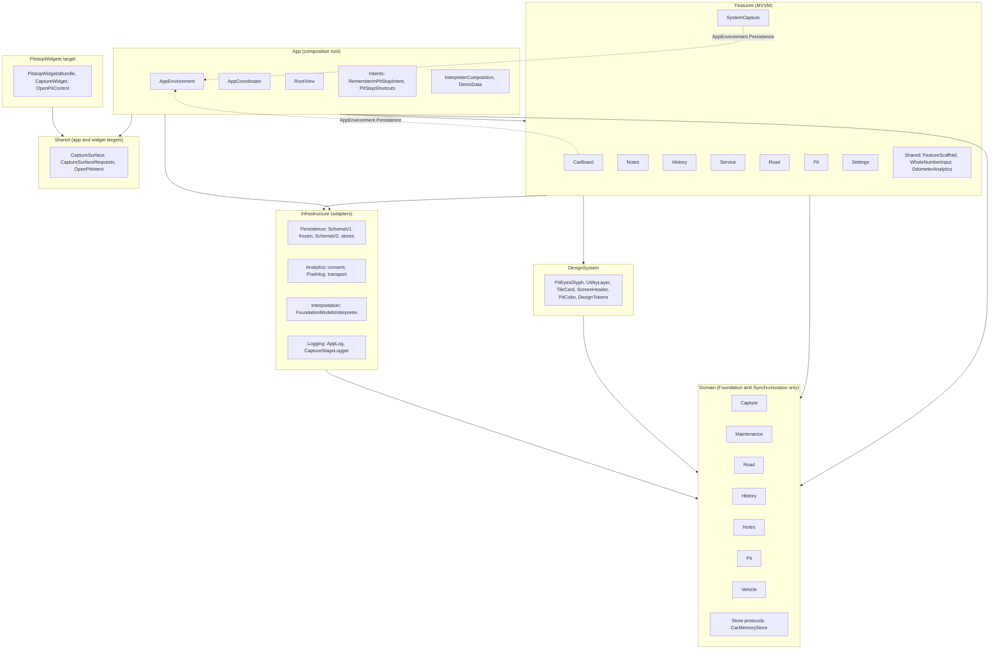
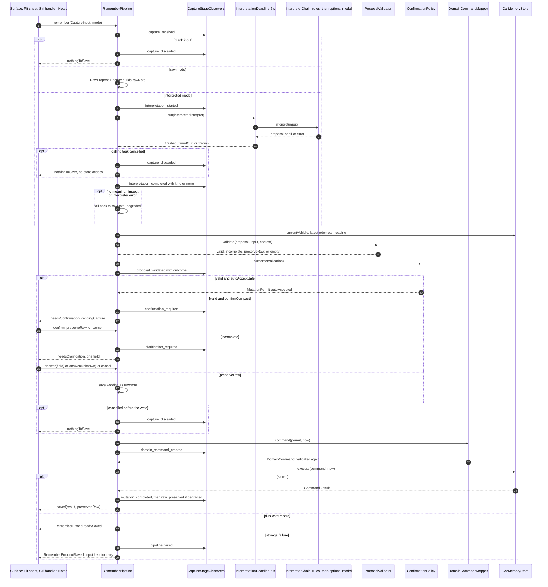
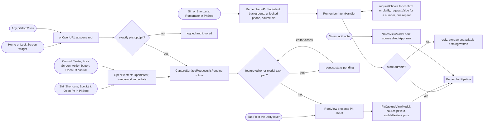
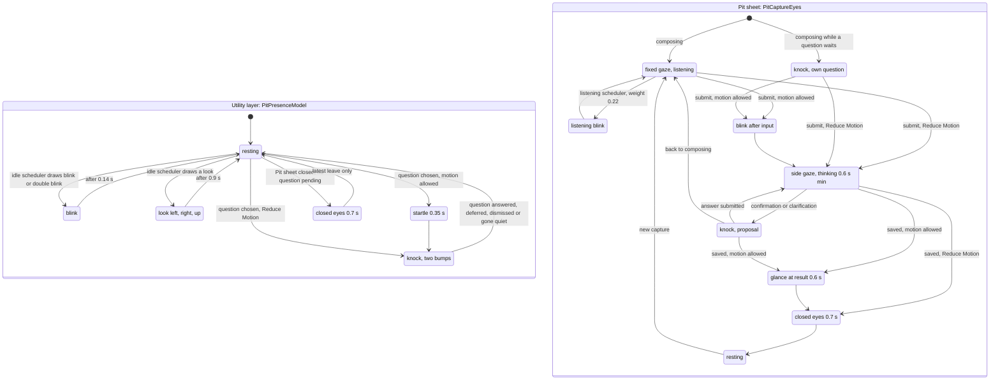
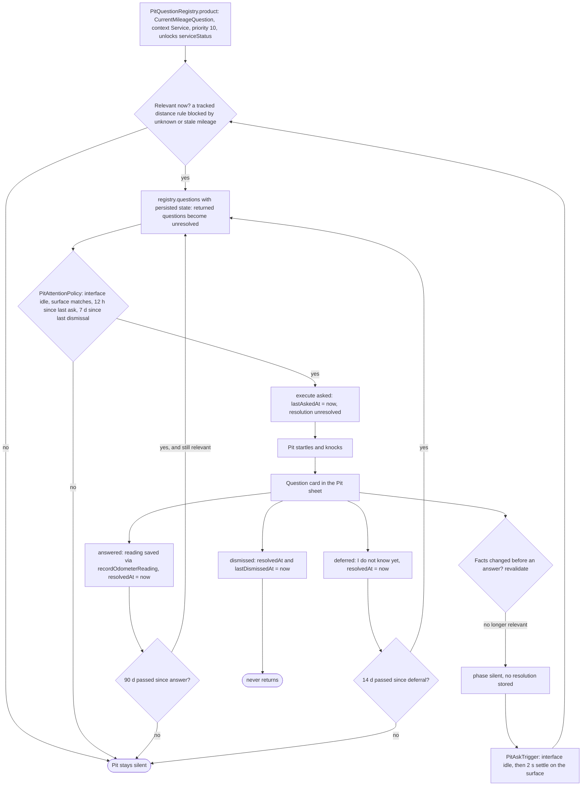
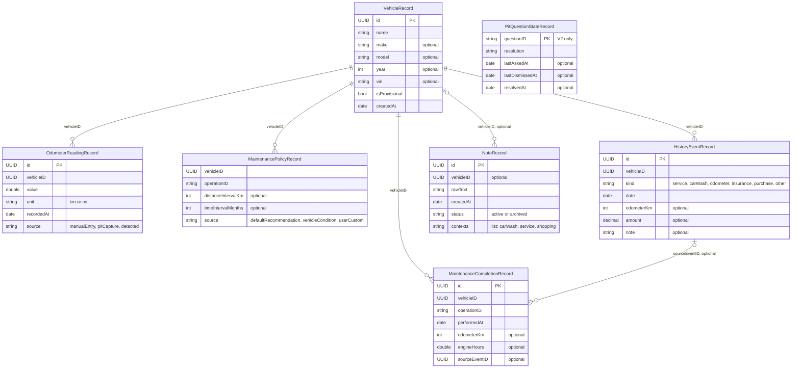
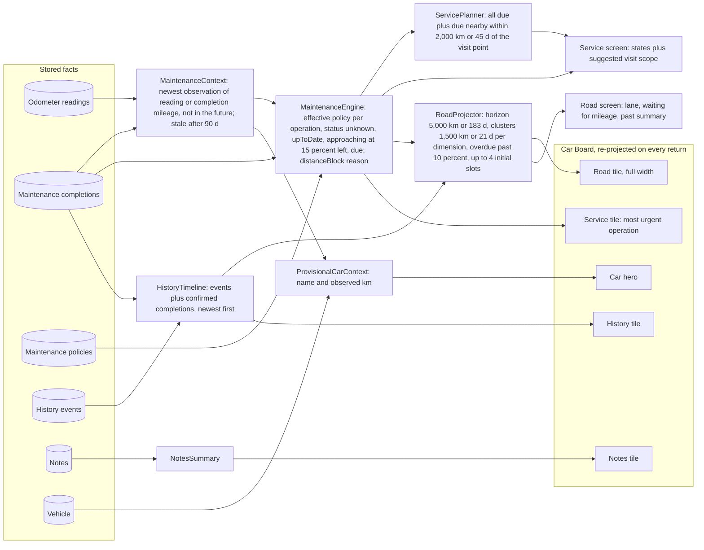

# System Overview (As Built)

**Status:** Descriptive snapshot of `main`, verified against the code on
2026-09-22. It records what is implemented, not what is required.\
**Owners it summarises:** behaviour contracts live in
[`../requirements/`](../requirements/), decisions in
[`../decisions/`](../decisions/), the implementation inventory in
[`domain-inventory.md`](domain-inventory.md). When this page and an owner
disagree, the owner and the code win; fix this page in the same change.

This page is one file on purpose. It is a map with diagrams that points into
the owning documents; splitting it into a `docs/spec/` folder would create a
second specification tree next to `requirements/` and `decisions/`, which the
documentation rule in [`../README.md`](../README.md) forbids. Every diagram is
Mermaid, which GitHub renders in place.

Contents:

1. [System context](#1-system-context)
2. [Modules and layers](#2-modules-and-layers)
3. [Capture pipeline](#3-capture-pipeline)
4. [Entry points](#4-entry-points)
5. [Pit motion states](#5-pit-motion-states)
6. [Pit question lifecycle](#6-pit-question-lifecycle)
7. [Data model](#7-data-model)
8. [Maintenance and Road projections](#8-maintenance-and-road-projections)
9. [Delivery pipeline](#9-delivery-pipeline)
10. [Feature matrix](#10-feature-matrix)

All examples are fictional.

---

## 1. System context

One process owns all car data. `PitstopApp` builds a single `AppEnvironment`
and registers the same `RememberIntentHandler` and `CaptureSurfaceRequests`
with `AppDependencyManager`, so a Siri save and the Pit sheet write to the
same SwiftData file ([`Pitstop/App/PitstopApp.swift`](../../Pitstop/App/PitstopApp.swift),
[ADR 0007](../decisions/0007-persistence.md), [ADR 0023](../decisions/0023-remember-intent.md)).
The widget extension shares only the `Shared/` sources and has no store, no
App Group, and no car data; both of its entries can only open the Pit sheet
([ADR 0025](../decisions/0025-widgets-and-controls.md)). Analytics leaves the
device only when the build carries `PostHogProjectAPIKey` and `PostHogHost`
and the user opted in under Settings; the repository ships no key, so the
gated no-op client is what runs ([ADR 0021](../decisions/0021-analytics-boundary.md),
[ADR 0022](../decisions/0022-posthog-http-adapter.md)). Foundation Models is
compiled in but composed only when a DEBUG build is launched with
`-pitstop-foundation-models` ([`InterpreterComposition.swift`](../../Pitstop/App/InterpreterComposition.swift),
[ADR 0027](../decisions/0027-foundation-models-interpreter.md)). Delivery is
outside the device: GitHub Actions only tests, Xcode Cloud only archives the
`testflight` branch ([ADR 0013](../decisions/0013-shared-ci-and-tag-gated-testflight.md)).

---

## 2. Modules and layers

The app is one Xcode target whose folders act as layers; there are no Swift
packages yet (the package split in [`modular-architecture.md`](modular-architecture.md)
is a target direction). Domain files import only `Foundation` and
`Synchronization`, so SwiftUI, SwiftData, OSLog, PostHog and Foundation Models
stay out of it. Infrastructure implements Domain protocols
(`CarMemoryStore`, `PitQuestionStateStore`, `SemanticInterpreting`,
`CaptureStageObserving`) and depends on nothing above it. Features depend on
Domain, the DesignSystem, and the analytics protocols; the DesignSystem depends
on Domain only for `PitState` and `PitActivity`. Two dotted edges are the
exceptions found while writing this page: `CarBoardViewModel` and
`RememberIntentHandler` read `AppEnvironment.Persistence` from the App layer
(see [Mismatches](#mismatches-found-while-writing-this-page)). `Shared/` is a
folder compiled into both the app and the widget extension
(`Pitstop.xcodeproj/project.xcproj`), which is how the control reaches
`OpenPitIntent`. Folder roots: [`Pitstop/Domain`](../../Pitstop/Domain),
[`Pitstop/Infrastructure`](../../Pitstop/Infrastructure),
[`Pitstop/Features`](../../Pitstop/Features), [`Pitstop/App`](../../Pitstop/App),
[`Pitstop/DesignSystem`](../../Pitstop/DesignSystem), [`Shared`](../../Shared),
[`PitstopWidgets`](../../PitstopWidgets).

---

## 3. Capture pipeline

Every capture source goes through one `RememberPipeline`
([`RememberPipeline.swift`](../../Pitstop/Domain/Capture/RememberPipeline.swift),
[ADR 0011](../decisions/0011-interpreted-capture-without-a-model.md)). Raw
mode never calls an interpreter. Interpreted mode races the interpreter against
`InterpretationDeadline.standard` (6 s) and never awaits the loser; a timeout,
a thrown error, or "no meaning" all fall back to saving the wording raw and
report `raw_preserved` only after the write succeeds
([`InterpretationDeadline.swift`](../../Pitstop/Domain/Capture/InterpretationDeadline.swift),
[ADR 0015](../decisions/0015-interpretation-deadline-and-cancellation.md)).
The app composes `RuleBasedInterpreter` alone, or in a DEBUG launch
`InterpreterChain([RuleBasedInterpreter(), FoundationModelsInterpreter()])`, so
the model can only add meaning the rules did not find
([ADR 0027](../decisions/0027-foundation-models-interpreter.md)). The
validator is pure and is the only producer of `ValidatedProposal`; the
`ConfirmationPolicy` is the only producer of a `MutationPermit`, and the mapper
accepts nothing else, so no path writes around the policy
([`ConfirmationPolicy.swift`](../../Pitstop/Domain/Capture/ConfirmationPolicy.swift),
[ADR 0006](../decisions/0006-capture-confirmation-policy.md)). Notes and
confident odometer readings or low-risk vehicle facts are auto-accepted;
maintenance completions, policies, events, expenses, anything with a conflict
(a reading below the latest, a replaced fact) and anything below confidence
0.8 need confirmation. Clarification asks one missing field at a time, and
"I don't know" saves the wording. Cancellation is checked after
interpretation and again at the last point before a write. Stage telemetry
(`CaptureStageEvent`) carries only the correlation ID, stage, source, kind and
outcome, never the words, and fans out to `CaptureStageLogger` and
`CaptureAnalyticsObserver` ([`CaptureStageEvent.swift`](../../Pitstop/Domain/Capture/CaptureStageEvent.swift),
[`AppCoordinator.swift`](../../Pitstop/App/AppCoordinator.swift)).
`capture_discarded` is still a proposed stage pending owner approval
(ADR 0006, ADR 0015).

---

## 4. Entry points

There are two kinds of external entry. **Remember** runs the capture in place
without opening the app: `RememberInPitStopIntent` asks Siri for the words,
refuses when the session store is temporary, and hands the text to
`RememberIntentHandler`, which builds a `CaptureInput` with source `.siri` and
drives the same pipeline, asking at most one question at a time
([`RememberIntentHandler.swift`](../../Pitstop/Features/SystemCapture/RememberIntentHandler.swift),
[ADR 0023](../decisions/0023-remember-intent.md),
[ADR 0026](../decisions/0026-siri-voice-clarification.md)). A spoken mileage
or amount is parsed, asked once more if unreadable, and always confirmed before
it is written; an operation or event kind is a choice from the catalog; a
vehicle fact or interval can only be kept as words. **Open Pit** never
captures by itself: `OpenPitIntent` (Shortcuts, Spotlight, and the control)
and the widget's `pitstop://pit` link only set `CaptureSurfaceRequests`, and
`RootView` presents the Pit sheet when no feature editor blocks it, so a
request during a cold launch or under an open editor is deferred, not lost
([`CaptureSurfaceRequests.swift`](../../Shared/CaptureSurfaceRequests.swift),
[`CaptureSurface.swift`](../../Shared/CaptureSurface.swift),
[ADR 0024](../decisions/0024-app-shortcuts.md), ADR 0025). The URL parser
rejects any path, query, fragment, user or port. Inside the app, the Pit sheet
and adding a note are also capture sources (`.pitText`, `.directApp`); the car
editor, Service actions and History editor write through `DomainCommand`s
directly because they are forms, not captures.

---

## 5. Pit motion states

Pit's eyes have two independent players that render one `PitState` each
([`PitPresence.swift`](../../Pitstop/Domain/Pit/PitPresence.swift),
[ADR 0012](../decisions/0012-pit-presence-and-attention.md),
[ADR 0019](../decisions/0019-pit-activity-reporting.md),
[ADR 0028](../decisions/0028-pit-eyes-and-motion.md)). In the utility layer,
`PitPresenceModel` runs the idle scheduler: an irregular weighted draw (blink
0.41, double blink 0.04, look left and right 0.10 each, look up 0.06, the
remaining 29% stillness) with a 4 to 19 s delay and a 6 s cooldown, and it
stops entirely while any surface reports scrolling, editing, capturing or a
modal task, while Reduce Motion is on, or while a question is pending
([`PitPresenceModel.swift`](../../Pitstop/Features/Pit/PitPresenceModel.swift)).
A chosen question plays startle then knock, or the knock alone with Reduce
Motion, and the knock holds until the question ends. Closing the Pit sheet
shows closed eyes for 0.7 s unless a question is knocking. In the sheet,
`PitCaptureEyes` plays the beats computed by `PitCaptureChoreography`:
listening holds a fixed gaze with rarer blinks (weight 0.22, delay up to 26 s),
input leads through blink and side gaze (held at least 0.6 s) to a proposal
knock or to glance, closed eyes and resting after a save
([`PitCaptureEyes.swift`](../../Pitstop/Features/Pit/PitCaptureEyes.swift)).
With Reduce Motion, idle actions, listening blinks, bounded "life"
(micro-saccades, drift, breathing), the post-input blink and the glance are
dropped; side gaze, knock without bumps, closed eyes and resting stay as state
changes. A double blink is two blink beats, not a state. `PitState.hidden` is
drawable (dimmed in `PitEyesGlyph`) but no model shows it, as ADR 0028 records.

---

## 6. Pit question lifecycle

The registry is the only source of questions, and a definition cannot exist
without a declared value and a declared return path
([`PitQuestionRegistry.swift`](../../Pitstop/Domain/Pit/PitQuestionRegistry.swift),
[ADR 0016](../decisions/0016-question-registry.md)). The one product question
asks for the current mileage on Service, and only while a tracked distance
rule is blocked because the mileage is unknown or older than 90 days
([`CurrentMileageQuestion.swift`](../../Pitstop/Domain/Pit/CurrentMileageQuestion.swift),
[ADR 0017](../decisions/0017-first-question-current-mileage.md)). `RootView`
checks only after the interface has been idle and the user has stayed on the
surface for 2 s; the check restarts after every navigation. The attention
policy then requires an idle interface (Reduce Motion does not count), the
matching surface, 12 hours since any ask and 7 days since any dismissal,
across all questions ([`PitPresence.swift`](../../Pitstop/Domain/Pit/PitPresence.swift)).
The ask is persisted before Pit knocks; if it cannot be persisted, Pit stays
silent ([`PitQuestionViewModel.swift`](../../Pitstop/Features/Pit/PitQuestionViewModel.swift)).
An answer writes the reading through the car store first and then records the
resolution. Return rules are declared per question and enforced by the store:
an answer holds for 90 days and returns only if still relevant, a deferral
returns after 14 days, a dismissal never returns, and a later "not now" cannot
undo an answer ([`PitQuestionState.swift`](../../Pitstop/Domain/Pit/PitQuestionState.swift),
[ADR 0018](../decisions/0018-attention-cooldown-and-return.md)). A capture or a
Siri save that supplies the mileage makes a pending question go quiet without
a resolution.

---

## 7. Data model

The store keeps one car (created provisionally on first read) and its facts as
SwiftData records in `Application Support/Pitstop.store`
([`PitstopSchemaV1.swift`](../../Pitstop/Infrastructure/Persistence/PitstopSchemaV1.swift),
[`PitstopSchemaV2.swift`](../../Pitstop/Infrastructure/Persistence/PitstopSchemaV2.swift),
[`PersistenceContainer.swift`](../../Pitstop/Infrastructure/Persistence/PersistenceContainer.swift)).
Links are UUID fields, not SwiftData relationships. Schema V1 is frozen: any
change to a record needs a new version with its own copy of the class. V2 adds
only `PitQuestionStateRecord` through a lightweight V1 to V2 stage in
`PitstopMigrationPlan`; the question store shares the container and file but is
a separate actor with its own protocol, so no capture can change question
state ([ADR 0007](../decisions/0007-persistence.md), ADR 0016). Policy rows are
keyed by vehicle, operation and source, so a custom interval never deletes a
recommendation row; the app ships no recommendation data today, so every
stored policy is `userCustom`. The only write path for car data is
`CarMemoryStore.execute(DomainCommand)`, which validates the command again and
rejects a repeated record ID as `duplicateRecord`
([`CarMemoryStore.swift`](../../Pitstop/Domain/Store/CarMemoryStore.swift),
[`DomainCommands.swift`](../../Pitstop/Domain/Capture/DomainCommands.swift)).
When the on-disk store cannot open, the session falls back to memory and the
UI says nothing will be kept (`AppEnvironment.Persistence.temporary`).

---

## 8. Maintenance and Road projections

Nothing on Car Board, Service or Road is stored; every number is recomputed
from facts on load ([`CarBoardViewModel.swift`](../../Pitstop/Features/CarBoard/CarBoardViewModel.swift),
[`ServiceViewModel.swift`](../../Pitstop/Features/Service/ServiceViewModel.swift),
[`RoadViewModel.swift`](../../Pitstop/Features/Road/RoadViewModel.swift)).
`MaintenanceContext` takes the newest mileage observation, whether an odometer
reading or a completion recorded with its mileage, and treats it as stale after
90 days; only a current observation feeds distance arithmetic
([`MaintenanceEngine.swift`](../../Pitstop/Domain/Maintenance/MaintenanceEngine.swift),
[ADR 0010](../decisions/0010-maintenance-engine-rules.md),
[ADR 0020](../decisions/0020-maintenance-anchor-closure.md)). The engine
derives one state per effective policy from the last confirmed completion: the
smallest remaining share of the known dimensions decides, an operation with no
completion is `unknown`, and a blocked distance rule is named
(`mileageUnknown`, `mileageStale`, `completionMileageMissing`) and makes a
time-only status partial. `ServicePlanner` groups everything due with work due
within 2,000 km or 45 days of the visit point
([`ServicePlanner.swift`](../../Pitstop/Domain/Maintenance/ServicePlanner.swift)).
`RoadProjector` places milestones in one lane in horizon units, clusters within
a dimension only, never converts kilometres to days, and moves distance-only
milestones it cannot place to "waiting for mileage"
([`RoadProjector.swift`](../../Pitstop/Domain/Road/RoadProjector.swift),
[`RoadProjection.swift`](../../Pitstop/Domain/Road/RoadProjection.swift),
[ADR 0008](../decisions/0008-road-projection-rules.md)). `RoadContext` accepts
planned vehicle events, but no store or entry exists for them yet
(ROAD-EVT-001 in the [work plan](../planning/work-plan.md)), so the app always
passes none. The board shows four tiles in a fixed V1 order
([`CarBoardTiles.swift`](../../Pitstop/Features/CarBoard/CarBoardTiles.swift),
[ADR 0009](../decisions/0009-design-language.md)) and reloads when the user
returns to it, when a utility sheet closes, and when the app returns from the
background.

---

## 9. Delivery pipeline

```mermaid
flowchart LR
    dev["Local change"]
    verify["just verify: baseline, format, lint, build for testing, tests"]
    push["git push to main, owner authorised"]
    tests["GitHub Actions tests.yml: just ci on hosted xcode-27 runner"]
    check["just tf-check: read-only, prints Ready and the tag commands"]
    tag["Annotated tag tf-MAJOR.MINOR.PATCH-BUILD on a commit of main"]
    promote["testflight.yml: tf-promote.sh checks main, MARKETING_VERSION, own green tests run"]
    branch["fast-forward testflight branch"]
    xcc["Xcode Cloud workflow TestFlight: Archive iOS, build number from CI_BUILD_NUMBER"]
    tfg["TestFlight group Internal"]
    vtag["v tag and App Review: owner only"]
    rules["Rulesets: main and testflight no deletion or force push; tf tags cannot move; v tags cannot move or be deleted"]

    dev --> verify --> push --> tests
    tests -- green --> check --> tag --> promote --> branch --> xcc --> tfg
    tfg -.-> vtag
    rules -.-> push
    rules -.-> tag
    rules -.-> branch
```

`just verify` is the implementation gate on the Mac; the hosted run on a push
to `main` repeats the tests and builds nothing for distribution
([`.github/workflows/tests.yml`](../../.github/workflows/tests.yml),
[ADR 0013](../decisions/0013-shared-ci-and-tag-gated-testflight.md),
[ADR 0014](../decisions/0014-public-repository.md)). A build is requested only
by a `tf-` tag: `testflight.yml` runs `Tooling/scripts/tf-promote.sh`, which
accepts the tag only when the commit is on `main`, every `MARKETING_VERSION`
equals the tag's version, and that commit has its own successful tests run;
it then fast-forwards `testflight`, which is the only branch the Xcode Cloud
workflow builds ([`.github/workflows/testflight.yml`](../../.github/workflows/testflight.yml),
[`Tooling/docs/testflight.md`](../../Tooling/docs/testflight.md)).
`ci_scripts/ci_post_clone.sh` sets the build number from Xcode Cloud. An agent
may push a `tf-` tag only after `just tf-check` prints `Ready`; `v` tags and
App Review are the owner's ([`AGENTS.md`](../../AGENTS.md)). The rulesets come
from [`Tooling/templates/github/rulesets/`](../../Tooling/templates/github/rulesets/).

---

## 10. Feature matrix

Verification status uses these terms. **Unit tests**: covered by the
`PitstopTests` suites named in the row, which `just verify` and the hosted tests
run. **Screen not verified**: listed under "Not verified on screen" in the
[work plan](../planning/work-plan.md). **Device check pending**: an owner-only
device check in the work plan. No row claims a manual check this page did not
record.

| Feature | User-visible behaviour | ADR(s) | Key code | Test suite(s) | Verification status |
|---|---|---|---|---|---|
| Car context | One provisional car created on first launch; name and mileage editable; hero shows the newest observed mileage | 0007, 0009 | `Domain/Vehicle/`, `Features/CarBoard/CarEditorView.swift`, `CarBoardViewModel.swift` | `ProvisionalCarContextTests`, `CarBoardViewModelTests` | Unit tests |
| Car Board | Hero plus Road, Notes, Service, History tiles in fixed order; utility layer with Settings and Pit on every screen; board refreshes on return | 0009 | `Features/CarBoard/`, `DesignSystem/Components/UtilityLayer.swift`, `App/RootView.swift` | `CarBoardTileDescriptorTests`, `CarBoardViewModelTests` | Unit tests; VoiceOver order, AX5, Reduce Transparency and ru/uk screens not verified |
| Persistence | Data survives relaunch; a failed on-disk store falls back to memory and says so; schema V1 frozen, V2 adds question state | 0007, 0016 | `Infrastructure/Persistence/`, `App/AppEnvironment.swift` | `PersistenceSchemaTests`, `SwiftDataCarMemoryStoreTests`, `SwiftDataPitQuestionStoreTests` | Unit tests |
| Notes | Add a note (raw capture), list active or archived, filter by context, correct, archive and restore; no AI | 0006, 0011 | `Features/Notes/`, `Domain/Notes/` | `NotesTests`, `FeatureAnalyticsTests` | Unit tests; correct, archive and restore not verified on screen |
| History | Record and correct events with optional mileage and amount; timeline of events and confirmed completions | 0007 | `Features/History/`, `Domain/History/HistoryTimeline.swift` | `HistoryTests` | Unit tests; add and correct not verified on screen |
| Service | Track an operation with a distance and/or time interval, mark done, change interval, undo the newest completion; status with reasons; suggested visit scope | 0001, 0010, 0020 | `Features/Service/`, `Domain/Maintenance/` | `MaintenanceEngineTests`, `ServicePlannerTests`, `ServiceViewModelTests` | Unit tests; Service actions not verified on screen |
| Road | Lane of maintenance milestones in horizon units, clusters, waiting-for-mileage list, past summary, back to now | 0008 | `Features/Road/`, `Domain/Road/` | `RoadProjectorTests`, `RoadViewModelTests` | Unit tests; lane scrolling, back to now, clusters and Reduce Motion not verified on screen |
| Remember in Pit | Type a thought; raw or interpreted mode; confirm, keep words only, answer one missing field, or "I don't know"; told where it was saved | 0006, 0011, 0015 | `Domain/Capture/`, `Features/Pit/PitCaptureViewModel.swift`, `PitCaptureView.swift` | `InterpretedRememberTests`, `RawFallbackTests`, `ConfirmationPolicyTests`, `ProposalValidatorTests`, `DomainCommandTests`, `RuleBasedInterpreterTests`, `CaptureInputTests`, `CaptureStageTests`, `RememberEndToEndTests` | Unit tests |
| Foundation Models interpreter | DEBUG builds launched with `-pitstop-foundation-models` ask the model after the rules; Release never does | 0027 | `Infrastructure/Interpretation/FoundationModelsInterpreter.swift`, `Domain/Capture/ModelDraft.swift`, `App/InterpreterComposition.swift` | `FoundationModelsInterpreterTests`, `InterpreterEvaluationTests` (golden set) | Unit tests with a fake model; device evaluation pending (DEV-FM) |
| Pit presence and motion | Eyes rest, blink and look around irregularly, yield to any activity, startle and knock to ask, think and glance in the sheet, close on leaving; Reduce Motion mapping | 0012, 0019, 0028 | `Domain/Pit/PitPresence.swift`, `Features/Pit/PitPresenceModel.swift`, `PitCaptureEyes.swift`, `PitActivityReporting.swift`, `DesignSystem/Components/PitEyesGlyph.swift` | `PitPresenceTests`, `PitCaptureEyesTests`, `PitEyesGlyphTests`, `PitLeavingTests`, `PitActivityReportingTests` | Unit tests; motion on screen not recorded here |
| Pit current-mileage question | On Service, when mileage is unknown or stale and a distance rule is tracked, Pit knocks once; answer, defer (14 d) or dismiss (never again); 12 h and 7 d cooldowns | 0016, 0017, 0018 | `Domain/Pit/`, `Features/Pit/PitQuestionViewModel.swift`, `PitQuestionCard.swift`, `PitAskTrigger.swift` | `PitQuestionRegistryTests`, `CurrentMileageQuestionTests`, `PitQuestionReturnTests`, `MileageQuestionReturnTests`, `MileageQuestionEndToEndTests` | Unit tests; returns that need days of clock time not verified on screen |
| Siri Remember | "Remember in PitStop": Siri asks for the words, confirms or asks one detail by voice, answers with where it saved; unlocked phone only; refused with temporary storage | 0023, 0026 | `App/Intents/RememberInPitStopIntent.swift`, `Features/SystemCapture/` | `RememberIntentHandlerTests`, `RememberSpeechTests` | Unit tests; device check pending (DEV-SIRI) |
| App Shortcuts | Remember and Open Pit shortcuts with en phrases in code and ru, uk phrases in the catalog | 0024 | `App/Intents/PitStopShortcuts.swift`, `Shared/OpenPitIntent.swift` | `AppShortcutsTests` | Unit tests; Shortcuts listing device check pending (DEV-WIDGET); ru and uk phrases await owner review |
| Widget and control | Data-free small and circular widget and an Open Pit control that open the Pit sheet; deferred while an editor is open | 0025 | `PitstopWidgets/`, `Shared/` | `WidgetEntryTests` | Unit tests; widget gallery, Control Center, Lock Screen and Action button device check pending (DEV-WIDGET) |
| Analytics | Off by default; Settings opt-in; closed event values without user text; PostHog adapter active only with a key and host in the build (none shipped) | 0002, 0021, 0022 | `Infrastructure/Analytics/`, `Features/Pit/CaptureAnalytics.swift`, `Features/Notes/NotesAnalytics.swift`, `Features/Settings/SettingsView.swift` | `AnalyticsBoundaryTests`, `CaptureAnalyticsTests`, `FeatureAnalyticsTests`, `PostHogAnalyticsClientTests` | Unit tests; no PostHog project exists, so delivery is untested end to end |
| Logging | OSLog categories; capture stages logged without content | 0003 | `Infrastructure/Logging/` | `CaptureStageTests` | Unit tests |
| App icon | Pit's resting eyes as a Liquid Glass icon with six appearances | 0029 | `Pitstop/AppIcon.icon` | none (asset) | Not covered by tests |
| Delivery | Tests on every push to `main`; TestFlight only from a `tf-` tag through Xcode Cloud | 0013, 0014 | `.github/workflows/`, `Tooling/scripts/`, `ci_scripts/` | Runtime contract tests in the toolchain, not in this repository | Rounds `tf-1.0.0-1`, `tf-1.1.0-1` and `tf-1.1.0-2` exist on the remote |

## Mismatches found while writing this page

Recorded here instead of silently corrected; each needs a code or document
change by its owner.

- **Features read an App-layer type.** `CarBoardViewModel` and
  `RememberIntentHandler` depend on `AppEnvironment.Persistence`, and
  `RememberIntentHandler` reuses `CarBoardViewModel.kilometers(from:)` and
  `HistoryViewModel.amount(from:)`. This contradicts the inward dependency rule
  in [`modular-architecture.md`](modular-architecture.md) and would block a
  package split.
- **Pit capture locale.** `CaptureInput.localeIdentifier` defaults to `ru_RU`,
  and `PitCaptureViewModel` does not pass the request locale. This is the
  planned CAP-LOC-001, not an undocumented defect.
